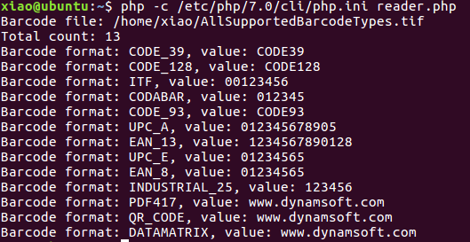

# PHP Barcode Reader for Linux

The sample demonstrates how to make PHP barcode reader on Ubuntu 16.04 with **PHP7** and **DBR 5.2** (Dynamsoft Barcode Reader for Linux).

## License
Get the [trial license](https://www.dynamsoft.com/CustomerPortal/Portal/Triallicense.aspx).

## Installation
* php7.0-cli, php7.0-dev, libxml2-dev

    ``` 
    sudo apt-get install php7.0-cli php7.0-dev libxml2-dev
    ```
* [php-7.0.29](http://php.net/get/php-7.0.29.tar.gz/from/a/mirror) source code 
* DBR 5.2

    1. Add public key:
        ```
        wget -O - http://labs.dynamsoft.com/debian/conf/dbr.gpg.key | sudo apt-key add -
        ```

    2. Add source to **/etc/apt/sources.list**:

        ```
        deb http://labs.dynamsoft.com/debian/ dbr main non-free
        ```

    3. Install Dynamsoft Barcode Reader:
        ```
        sudo apt-get update && install dbr
        ```

## How to Build the Extension
1. Unzip PHP source code and then change directory to **ext**:

    ```
    tar -xzf php-7.0.29.tar.gz
    cd ~/php-7.0.29/ext/
    ```

2. Create an extension folder:

    ```
    ./ext_skel --extname=dbr
    cd dbr
    ```

3. Copy **config.m4** and **dbr.c** to **~/php-7.0.29/ext/dbr**:
4. Copy **php.ini** to **/etc/php/7.0/cli/php.ini**.
5. Build and install the extension **dbr.so**:
    
    ```
    phpize
    ./configure
    make
    sudo make install
    ```
6. Run **reader.php**:
    
    ```
    php -c /etc/php/7.0/cli/php.ini reader.php
    ```
    

## Online Barcode Reader with PHP Custom Extension
Get the [source code][3] and deploy it to any web server.


### PHP on Apache
1. Install **php5-curl**, **apache2** and **libapache2-mod-php5**:

    ```
    sudo apt-get install php5-curl apache2 libapache2-mod-php5
    ```
2. Add extension path to php.ini:

    ```
    extension=/usr/lib/php5/20121212/dbr.so
    ```
3. Get write permissions:

    ```
    sudo chgrp -R www-data /var/www/html/reader
    sudo chmod -R g+rw /var/www/html/reader
    ```
4. Start **Apache**:
    
    ```
    sudo service apache2 start
    #sudo service apache2 stop // if you want to stop Apache
    ```
5. Visit **http://localhost/reader.php**.

### PHP on Nginx
1. Install **Nginx** and **php5-cgi**:

    ```
    sudo apt-get install nginx php5-cgi
    ```
2. Enable PHP in configuration file:
    
    ```
    sudo vi /etc/nginx/sites-available/default
    ```
    
3. Get write permissions:
    
    ```
    sudo chgrp -R www-data /usr/share/nginx/html/reader
    sudo chmod -R g+rw /usr/share/nginx/html/reader
    ```
4. Run **Nginx** and **php-cgi**:
    
    ```
    sudo nginx
    # sudo nginx –s stop // if you want to stop Nginx
    sudo php-cgi -b 127.0.0.1:9000 -c /usr/share/php5/php.ini-production
    ```
5. Visit **http://localhost/reader.php**.

## Blog
* [Updating PHP Barcode Extension for PHP7](http://www.codepool.biz/php-barcode-linux-ubuntu-php7.html)
* [How to Make PHP Barcode Reader on Linux][4]
* [How to Deploy PHP Code to Apache and Nginx on Ubuntu 14.04][5]

[1]:http://labs.dynamsoft.com/linux-barcode-reader-overview.htm
[2]:http://php.net/downloads.php
[3]:https://github.com/dynamsoftlabs/linux-php-barcode-reader-/tree/master/reader
[4]:http://www.codepool.biz/linux-php-barcode-reader.html
[5]:http://www.codepool.biz/deploy-php-nginx-apache-ubuntu.html

